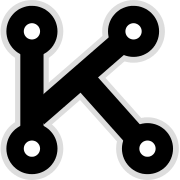

# 

**Ktistec** is an ActivityPub (https://www.w3.org/TR/activitypub/) server.
It is intended for individual users, not farms of users, although
support for additional users will be added in the future. It is
designed to have few runtime dependencies -- for example, it uses
SQLite as its database, instead of PostgreSQL + Redis + etc. It is
licensed under the AGPLv3.

Ktistec powers [Epiktistes](https://epiktistes.com/), my low-volume
home in the Fediverse.

## Features

### Posting text and images

Ktistec is intended for writing and currently supports the minimum
viable set of tools for that purpose.

Text formatting options include *bold*, *italic*, *strikethrough*,
*code* (inline and block), *superscript*/*subscript*, *headers*,
*blockquotes* with nested indentation, and both *bullet* and *numeric*
lists.

Ktistec supports inline placement of images, with ActivityPub image
attachments used for compatibility with non-Ktistec servers.

### Drafts

Meaningful writing is an iterative process so Ktistec supports draft
posts. Draft posts aren't visible in your timeline until you publish
them.

### Threaded replies

Threaded replies make it easier to follow discussions with lots of
posts.

### @-mention and #-hashtag autocomplete

Ktistec automatically converts @-mentions and #-hashtags into links,
and to encourage hands-on-the-keyboard composition, Ktistec supports
autocompletion.

### Followers/following

The Fediverse is a distributed social network. You can follow other
users on other servers from your timeline or by searching for them by
name. Ktistec is also compatible with the "remote follow" protocol
used by Mastodon and others.

## Prerequisites

To run an instance of Ktistec, you'll need a server with a permanent
hostname (AKA it's own domain). In the Fediverse, users are identified
by (and content is addressed to) a hostname and a username.

## Installation

You must build Ktistec from its source code. You will need a recent
release of the [Crystal programming language](https://crystal-lang.org/).

If you intend to do *development*, check out the **main** branch. In
addition to Crystal, you'll also need Webpack to build the JavaScript
and CSS assets from source.

If you just want to try Ktistec out, check out the **dist** branch.

Since the project is still in development, I don't bother with a
separate build step. I just run the server:

`$ LOG_LEVEL=INFO crystal run src/ktistec/server.cr`

## Usage

The server runs on port 3000. If you're planning on running it in
production, you should put Nginx or Apache in front of it. Don't
forget your SSL certificate!

When you run Ktistec for the first time, you'll need to name the
server and create the primary user.

Ktistec needs to know the *host name* of its home on the internet.
The server host name is a part of every users's identity in the
Fediverse. My identity is "toddsundsted@epiktistes.com". The host name
is "epiktistes.com" and other federated servers, and users, know to
send posts and other content to me there.

Give the server a *site name*, too.

After you name the server, you create the primary user. Ktistec
currently supports only one user. This is intentional -- one of
Ktistec's design goals is to promote a more fully distributed
Fediverse.

At a minimum, you need to specify the user's *username* and
*password*. You can use a single character for the username if you
want, but you'll need six characters, including letters, numbers and
symbols, for the password.

*Display name* and *summary* are optional.

Once these steps are done, you're running!

## Contributors

- [Todd Sundsted](https://github.com/toddsundsted) - creator and maintainer

## Copyright and License

Ktistec ActivityPub Server
Copyright (C) 2021 Todd Sundsted

This program is free software: you can redistribute it and/or modify
it under the terms of the GNU Affero General Public License as
published by the Free Software Foundation, either version 3 of the
License, or (at your option) any later version.

This program is distributed in the hope that it will be useful, but
WITHOUT ANY WARRANTY; without even the implied warranty of
MERCHANTABILITY or FITNESS FOR A PARTICULAR PURPOSE. See the GNU
Affero General Public License for more details.

You should have received a copy of the GNU Affero General Public
License along with this program. If not, see
(https://www.gnu.org/licenses/).
